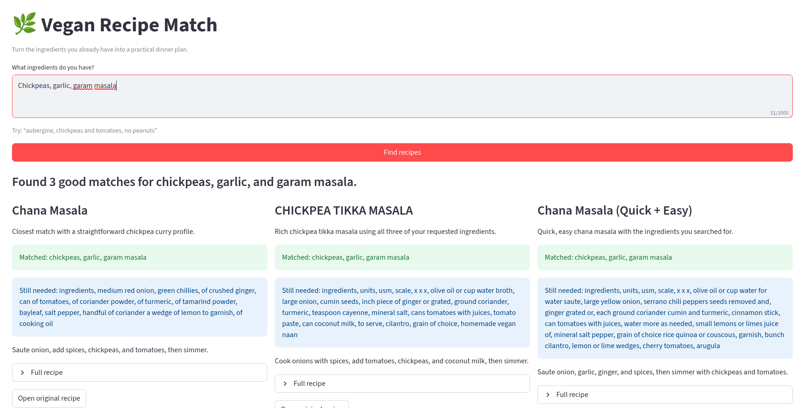
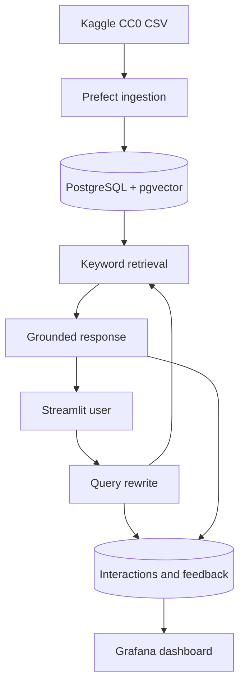

# Vegan Recipes Assistant

An English-language recipe finder for home cooks who want to use what is already in the kitchen. Enter ingredients and exclusions; the app searches 1390 vegan recipes, ranks practical matches, and recommends 2–3 existing recipes with missing ingredients and source links.

## App preview



The assistant never invents recipes. Its evaluated default is PostgreSQL full-text search; hybrid vector retrieval with reciprocal-rank fusion and ingredient reranking remains available. Exclusions are hard filters. OpenAI rewrites queries and produces a structured explanation; both calls have deterministic fallbacks.

## Architecture



## Quick start

Requirements: Docker Compose v2, 8 GB free RAM/disk, and optionally an OpenAI API key. The local embedding model is downloaded once during ingestion.

```bash
# Run these commands from the vegan-recipes-assistant directory.
cp .env.example .env
# Optional: edit .env and set OPENAI_API_KEY. Search has a deterministic fallback.

# 1. Start PostgreSQL and wait for its health check.
docker compose up -d --wait postgres

# 2. Download, validate, embed, and load all 1390 recipes.
# The first run downloads the local embedding model and can take several minutes.
docker compose --profile ingest run --rm --build ingest

# 3. Confirm ingestion completed. This must print 1390.
docker compose exec -T postgres psql -U recipes -d recipes -tAc "SELECT count(*) FROM recipes;"

# 4. Start the web app and dashboard in the background, then wait until healthy.
docker compose up -d --build --wait app grafana

# 5. Confirm that the HTTP endpoint responds with ok.
curl --fail http://localhost:8501/_stcore/health
```

Open the recipe app at <http://localhost:8501> and Grafana at <http://localhost:3000> (`admin` / `admin`). The dashboard is provisioned automatically. Re-running ingestion upserts stable URL-derived IDs and does not duplicate rows.

Useful lifecycle commands:

```bash
docker compose ps                    # service status and published ports
docker compose logs --tail=100 app   # diagnose app startup
docker compose stop                  # stop services but retain recipe data
docker compose down                  # remove containers but retain recipe data
```

For local development:

```bash
make setup
make test
make lint
PYTHONPATH=src uv run streamlit run app.py
```

## Configuration

| Variable | Purpose | Default |
|---|---|---|
| `DATABASE_URL` | PostgreSQL connection | Compose database |
| `OPENAI_API_KEY` | Query rewrite and final explanation | empty (fallback mode) |
| `OPENAI_MODEL` | Responses API model | `gpt-5.4-mini` |
| `RETRIEVAL_MODE` | Evaluated retrieval mode | `keyword` |
| `RECOMMENDATION_PROMPT` | Evaluated response prompt | `concise` |
| `DATASET_SHA256` | Pinned archive checksum | verified SHA256 in `.env.example` |
| `INPUT_COST_PER_MILLION` | Monitoring estimate | `0.40` |
| `OUTPUT_COST_PER_MILLION` | Monitoring estimate | `1.60` |

The Responses API uses Pydantic structured outputs following the [official OpenAI structured-output guide](https://developers.openai.com/api/docs/guides/structured-outputs). Costs are configurable estimates, not billing records.

## Data and ingestion

Source: Rodrigo Azevedo Silva's [Vegan Recipes dataset](https://www.kaggle.com/datasets/rodrigoazs/vegan-recipes), declared CC0/public domain on Kaggle. The credential-free Kaggle API archive is validated for `href`, `title`, `ingredients`, and `preparation` plus exactly 1390 rows. Source-index columns are dropped; duplicate titles are preserved because URLs identify recipes.

Quantities, units, preparation adjectives, whitespace, and a documented alias map are normalized only for matching. Original ingredient strings remain visible. Water, salt, pepper, and common oil are pantry staples: visible, but not counted as missing. Embeddings use pinned revision `c9745ed…` of `all-MiniLM-L6-v2` and have 384 dimensions.

The verified archive SHA256 is pinned in `.env.example` and ingestion aborts before parsing if it differs.

## Retrieval and safety

PostgreSQL weighted `tsvector` search is the evaluated default. pgvector HNSW, RRF, and ingredient reranking remain available as the evaluated hybrid alternative. Exclusions are hard filters.

Inputs are capped at 1000 characters. Prompts label user and dataset content as untrusted data. Pydantic validates all responses, every recommended ID must exist in the five-record context, and matched/missing claims are overwritten with deterministic reranker results. Empty input, API failures, malformed output, timeouts, and invented IDs degrade to actionable errors or database-ranked cards.

This is a cooking discovery tool, not allergy or medical advice. Always inspect the linked source and ingredient labels.

## Evaluation

The short, reproducible workflow is in [`evaluation/README.md`](evaluation/README.md). It generates 60 ingredient-availability queries linked to 20 known recipes, compares keyword with hybrid retrieval, and compares concise with detailed structured prompts.

The current winners are `keyword` retrieval (Hit Rate@5 0.833, MRR@5 0.772) and the tie-broken `concise` prompt (40% good answers each). Both are application defaults. The generated set is a regression check, not a substitute for real-user or human-labelled data. See the committed [retrieval report](evaluation/results/retrieval_report.md) and [LLM report](evaluation/results/llm/llm_report.md).
## Monitoring

Every interaction stores raw/parsed queries, the top 20 candidates, selected IDs, status, stage timings, model, tokens, cost estimate, errors, and feedback. Grafana provisions:

1. requests over time;
2. success/error rate;
3. average and p95 latency;
4. retrieval versus LLM latency;
5. token usage;
6. estimated cost;
7. feedback distribution.

## Rubric evidence

| Criterion | Evidence |
|---|---|
| Problem and audience | Opening section and UI |
| Knowledge base + LLM | `store.py`, `assistant.py` |
| Retrieval evaluation | `evaluation/` generated-query comparison |
| LLM evaluation | `evaluation/README.md` and `llm_eval.py` (requires an API key) |
| Interface | `app.py` Streamlit cards and feedback |
| Automated ingestion | `ingest.py` Prefect flow |
| Monitoring | interaction schema and 7-panel dashboard |
| Containerization | complete `docker-compose.yml` |
| Reproducibility | pinned Python/images/model revision, commands above |
| Hybrid/reranking/rewrite | `store.py`, `retrieval.py`, `assistant.py` |

## Troubleshooting and limitations

- Database unavailable: wait for `docker compose ps` to report PostgreSQL healthy.
- First ingestion is slow: the ONNX model is downloaded and 1390 embeddings are computed locally.
- No API key: search still works and deterministic cards are shown; query understanding is simpler.
- Dataset update: row/schema/checksum guards intentionally fail. Review the new archive before changing expectations.
- English only; aliases are deliberately small. Ingredient substring matching can occasionally over-match.
- No cloud deployment is included.
